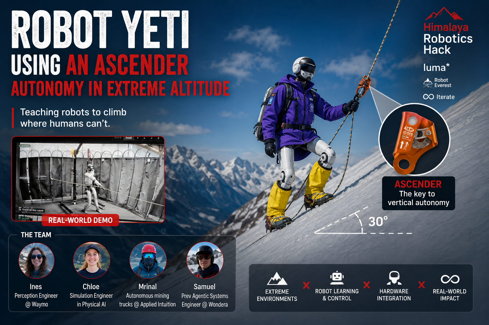

# Robot Yeti — autonomy in extreme altitude



Teaching a Unitree G1 to climb where humans can't: up a fixed rope on a Himalayan
snow slope, with a real mechanical **ascender** on its right wrist. The ascender is
a one-way cam — it slides up the rope and locks under load — so the robot can push
it ahead, weight it, and step up, the way a climber does on the Lhotse Face.

Built at the **Himalaya Robotics Hack** (Robot Everest × Iterate). Everything here
runs in simulation today; the walking half has been on real hardware.

## What actually works

| | Status |
|---|---|
| **Ascender climb policy** (mjlab PPO, `rl/chloe`) | Climbs a 20° slope in sim: ~0.3 m/s uphill, ascender pushed 3–4 m in 10 s, no falls under wind + ice randomisation. Verified in plain MuJoCo (sim2sim). |
| **Interactive climber in the browser** (`app/harness`) | The merged Lhotse scene at 50 Hz on a laptop, streamed to a three.js page — wind, visibility, first/third person. |
| **Walking on the real G1** (`deploy/`) | Pure-NumPy policy inference on the robot, a gated hardware session, and a scripted rope-hold mime. Ran on the gantry G1. |
| **Battery + thermal panel** (`app/bms`, `app/bms_ui`) | Real DDS telemetry off the robot, and a simulated pack model driven by the harness's own joint torques. |
| **Human safety gate** (`human-safety/`) | The robot may not climb *up* while a person is in front of it. |
| **Climb policy on hardware** | Not yet. See `rl/chloe/ROADMAP.md`. |

## Two RL stacks, on purpose

This trips people up, so it's worth stating plainly. The repo has **two separate
reinforcement-learning stacks** that do not share code, envs, or policy formats:

- **`rl/chloe/` — mjlab + rsl_rl (PyTorch).** The **ascender climb** task. 4096
  robots on one GPU, slope as tilted gravity, the rope and cam as a real
  mechanism. This is where the climb policies come from. Trains on Hugging Face
  Jobs. → [`rl/chloe/README.md`](rl/chloe/README.md)
- **`rl/environment/` — MuJoCo Playground + brax (JAX).** The **walking and wind**
  work: the G1 joystick task with domain randomisation, wind as quadratic drag,
  and a climb task on the measured Lhotse terrain. The pretrained `mels` walker
  lives here and is the legs of the deployed mime. → [`rl/README.md`](rl/README.md)

A policy from one will not load into the other. Check which stack a script belongs
to before reaching for an interpreter.

## Repo map

| Path | What's in it |
|---|---|
| `rl/chloe/` | Ascender climb task, rewards, domain randomisation, trained policies, ONNX export, sim2sim |
| `rl/environment/` | Playground envs: `G1JoystickWalkDR`, `G1JoystickWind*`, `G1ClimbTerrain` |
| `rl/scripts/` | Playground trainer, GPU trainer, interactive WASD viewer |
| `rl/policies/` | Saved weights, including `mels_g1_joystick.npz` (the baseline walker) |
| `app/harness/` | The interactive climber — builds the merged scene, steps physics, streams to the browser |
| `app/web/` | `render3d.html`: the three.js page, sky, sounds |
| `app/bms/`, `app/bms_ui/` | Battery/thermal — real DDS readings, and the simulated pack panel |
| `deploy/` | On-robot code: NumPy inference, safety, the gated hardware session, per-joint diagnostics |
| `human-safety/` | The human-detection gate (standalone; not part of any policy) |
| `assets/robots/` | G1 MJCF/USD, the ascender, and the shared rope + rail mechanism |
| `assets/environments/` | Real Lhotse Face heightfield (MuJoCo) and the Isaac Sim test pad |
| `assets/ascender/` | Ascender CAD, textures, mount contract |

## Quickstart

**Climb policy — train, watch, export.** Needs a CUDA GPU and mjlab.

```bash
python -m rl.chloe.scripts.train_mjlab_ppo Himalayas-Ascender-Slope20-G1 \
    --env.scene.num-envs 512 --agent.max-iterations 5000
python -m rl.chloe.scripts.play_mjlab Himalayas-Ascender-Slope20-G1 \
    --checkpoint-file rl/chloe/policies/g1_ascender_slope20_v3_2026-08-30_04-35-59.pt
python -m rl.chloe.scripts.export_onnx Himalayas-Ascender-Slope20-G1 <ckpt.pt> policy.onnx
```

**The interactive climber**, on localhost:

```bash
pip install websockets pillow            # the only extras the harness needs
python -m app.harness.runtime --live --world lhotse_B
```

Then open **http://localhost:8766/**. Click the view to take the pointer, hold **W**
to walk/climb, mouse to look, **R** resets, **Esc** pauses. Twelve `ClimbScene`
worlds in the selector, plus four legacy flat-plane ones.

**The WASD viewer** with the baseline walker (Playground stack):

```bash
python -m rl.scripts.viewer --policy mels
```

`W`/`S` forward/back, `Q`/`E` strafe, `A`/`D` turn, `↑`/`↓` wind ±2 m/s,
`←`/`→` wind heading ±15°, `0` wind off, `X` zero command.

**Real terrain**, straight from Copernicus GLO-30 + OSM route nodes:

```bash
cd assets/environments/lhotse_face
python mujoco_scene.py --list        # all nine patches, with their class
python mujoco_scene.py --patch B     # real Lhotse Face, 38.8 deg
```

Four patches are real measurements and five have the slope overridden for
curriculum — read that folder's REAL vs SYNTHETIC section before quoting a
number anywhere.

## Two rules worth knowing before you touch anything

**A policy is only valid with the rope model it was trained on.** The ascender's
position is in the observation, so any change to `assets/robots/mujoco/rope_rail.py`
changes what those numbers mean and silently invalidates the network. v1 climbed
happily in its own world and falls on the fixed rope. Retrain, or don't touch the
geometry.

**Report per joint and per dimension, never a max across all 29.** During the first
gantry session a single scalar `|q − target|max` produced two confident and
completely wrong diagnoses before per-joint reporting settled it in one run. Every
tool in `deploy/diagnostics/` preserves the breakdown, and so should anything new.

## Environments

Python versions differ per stack, which is the main setup friction:

- **mjlab stack** (`rl/chloe`) — `pip install mjlab onnx onnxscript` in a Python 3.11
  venv. Needs a CUDA GPU; there is no CPU fallback worth using.
- **Playground stack** (`rl/environment`, `rl/scripts`, `app/harness`) —
  `pip install -r requirements.txt` (jax 0.11.1 + `playground==0.2.0`,
  `mujoco==3.12.0`, `brax==0.14.2`).
- **On the robot** (`deploy/`) — the **system** interpreter, not a conda env: conda
  shadows `python3` and the Unitree SDK is only installed on the system one.
  `pip install unitree_sdk2py cyclonedds`.

`brax==0.14.2` calls `jax.device_put_replicated`, which JAX 0.11 removed; the call
in `brax/training/agents/ppo/train.py` is patched in place with a `device_put` +
stack shim. A brax or JAX upgrade may obsolete or revert that patch.

## The team

Built by **Ines Dormoy** (perception, Waymo), **Chloe Pilon Vaillancourt**
(simulation, physical AI), **Mrinal Jain** (autonomy, Applied Intuition), and
**Jingxi "Samuel" Deng** (agentic systems, Wondera) at the Himalaya Robotics Hack.
